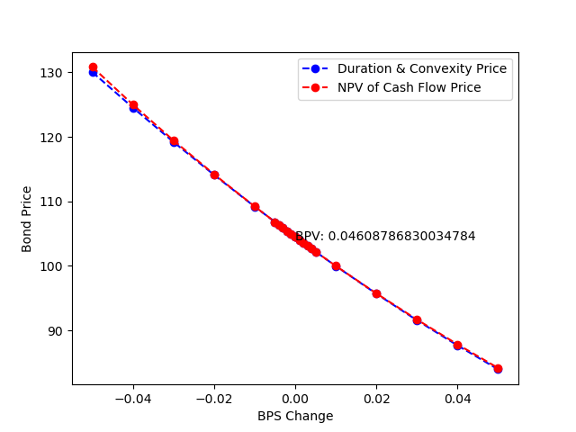

Bond Repricer
---------------------

 * Introduction
 * Setup
 * Running the Application
 * Example
  * Results

Introduction
------------

This application allows the user to reprice a vanilla bond using the net present value of cash flows methodology
or by using duration and convexity. This renders itself useful for stress testing based on changes in the yield curve.
 

Setup
------------

To properly run the application, you will need a python 3 environment (preferably 3.7) with numpy, pandas, 
and matplotlib installed.


Running the Application
-------------
To run the application, open the project in your favorite IDE and activate your python environment
from above. Run the main.py file. 

If you prefer the command line, enter the directory of the project and activate your python environment
created above and run:

`
python main.py
` 

Output png files will be saved and the simulation statistics will be printed in the terminal.


Example
-----------------

Under the current settings, we reprice a vanilla bond at various increments of basis point changes in the yield. For
simplicity we instantiate the bond with the following price, face value, yield-to-maturity, coupon rate, coupon 
frequency, and years to maturity below:

```       
Bond(price=100, face_value=100, ytm=0.04, coupon_rate=0.05, coupon_freq=2, years=5)
```

Results
-----------------
We recalculate the bond price for basis point changes between -0.05 and +0.05. The BPV (DV01) is
the change in bond price from a 1 basis point change in the yield, which is annotated below.



The new prices via duration and convexity:
```
    Basis Point Change  Bond Price
              -0.050      130.05
              -0.040      124.54
              -0.030      119.22
              -0.020      114.11
              -0.010      109.20
              -0.005      106.82
              -0.004      106.35
              -0.003      105.88
              -0.002      105.42
              -0.001      104.95
               0.000      104.49
               0.000      104.49
               0.001      104.03
               0.002      103.57
               0.003      103.12
               0.004      102.66
               0.005      102.21
               0.010       99.98
               0.020       95.68
               0.030       91.57
               0.040       87.67
               0.050       83.96
```


New prices via net present value of cash flow:
```
    Basis Point Change  Bond Price
              -0.050  130.841772
              -0.040  125.000000
              -0.030  119.460824
              -0.020  114.206957
              -0.010  109.222185
              -0.005  106.825917
              -0.004  106.354118
              -0.003  105.884770
              -0.002  105.417859
              -0.001  104.953371
               0.000  104.491293
               0.000  104.491293
               0.001  104.031609
               0.002  103.574307
               0.003  103.119373
               0.004  102.666793
               0.005  102.216554
               0.010  100.000000
               0.020   95.734899
               0.030   91.683395
               0.040   87.833656
               0.050   84.174564

```
 


